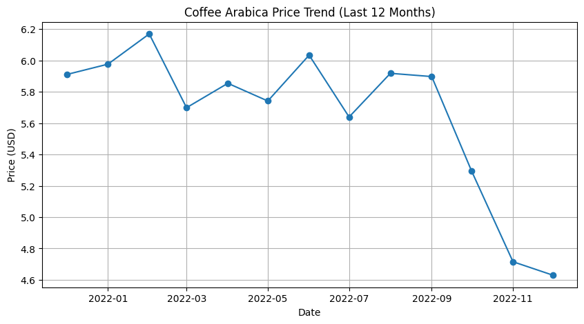
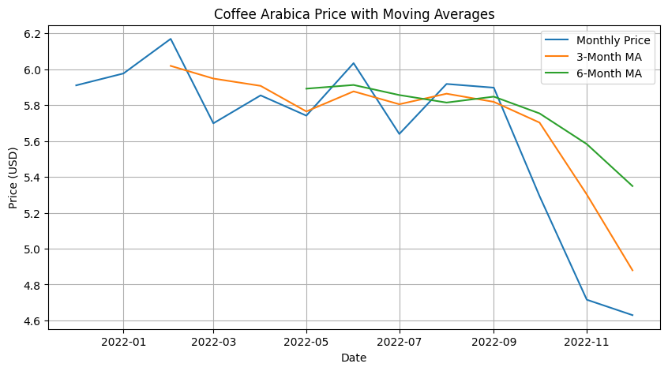
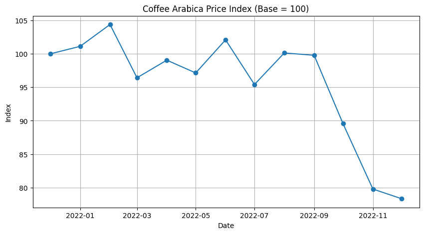
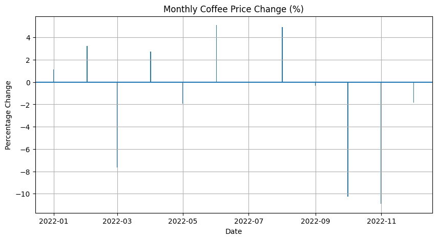

# 📡 ECX Proxy Analysis

This project analyzes market trends and proxy behavior in the Ethiopian Coffee Exchange (ECX), focusing on Coffee Arabica price dynamics.  
It combines data visualization, moving average analysis, and volatility tracking to support decision‑making and risk modeling.

---

## 📂 Repository Structure
ecx-proxy-analysis/ │ ├── assets/ │   └── images/                # Visual results and charts │ ├── notebooks/                 # Jupyter notebooks with analysis │ ├── data/                      # Raw and processed datasets │ ├── requirements.txt           # Reproducible environment ├── README.md                  # Project documentation └── LICENSE                    # Open source license

---

## 📊 Results Overview

This section presents key visual insights from the Coffee Arabica market analysis, highlighting price trends, volatility, and moving average behavior.

---
### ☕ Coffee Arabica Price Trend (Last 12 Months)


This chart illustrates the monthly price fluctuations of Coffee Arabica over the past year, highlighting seasonal volatility and long‑term market trends.

### ☕ Coffee Arabica Price with Moving Averages



This chart overlays short‑term and long‑term moving averages on the raw price trend, revealing momentum shifts and smoothing out volatility.  
It helps identify potential inflection points and supports proxy‑based forecasting strategies.

---

### 📈 Coffee Arabica Price Index



The index tracks normalized price movements from January to November 2022.  
After peaking in February, the market shows a steady decline, dropping below 80 by November — a signal of sustained bearish pressure.

---

### 📉 Monthly Coffee Price Change



This bar chart highlights month‑over‑month fluctuations in Coffee Arabica prices.  
It reveals seasonal volatility and helps quantify short‑term market shocks that may affect proxy behavior.

---

## ✅ Key Takeaways
- Moving averages smooth out noise and reveal long‑term trends.  
- The price index shows a clear downward trajectory in 2022.  
- Monthly changes expose volatility patterns useful for proxy calibration and risk modeling.

---

## 🚀 How to Reproduce

1. Clone the repository:
   ```bash
   git clone https://github.com/aronbisrat/ecx-proxy-analysis.git

- Install dependencies:

pip install -r requirements.txt

👤 About Me

I'm Aron — a data scientist passionate about reproducible workflows, impactful storytelling, and principled analysis.
This project reflects my interest in market dynamics, proxy modeling, and visual communication.

📜 License

This project is licensed under the MIT License — see the LICENSE file for details.
---

## ✅ What This README Delivers

- **Professional structure** with clear sections  
- **Visual storytelling** with embedded charts and captions  
- **Reproducibility instructions** for collaborators or recruiters  
- **Personal branding** with a concise “About Me”  

